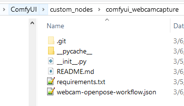

# Comfyui Webcam capture node

This node captures images one at a time from your webcam. 

This is particular useful for img2img or controlnet workflows. 

This node will take over your webcam, so if you have another program using it, you may need to close that program first.  Likewise, you may need to close Comfyui or close the workflow to release the webcam.

### Why do we need another webcam node?

The other ones simply don't work or are buggy, produce black images, digital noise, etc. 

I've added extra parameters exposed by cv2 to allow you to tweak the webcam settings to (hopefully) get yours to work. There's no gaurantee every parameter will work on every webcam, but the hope is by exposing them you can tweak them to get your webcam to work. Defaults should be sane.

### Ideas for use

* Setup an action figure in front of your webcam and use pose estimation and pose controlnet.
* Point it at yourself and use a depth estimator and controlnet.

### Install

`git clone` this into your comfyui `custom_nodes` directory.

Activate your comfyui environment and run `pip install opencv-python`.

If you installed it correctly you should see something like this (don't worry about the .git and __pycache__ directories if you don't see them): 

 

### Suggested supporting nodes/workflows

* ControlNet Preprocessors > Faces and Poses Estimators > (DensePose, DWPose, OpenPose, etc)
* ControlNet Preprocessors > Normal and Depth Estimators > (DepthAnything, MiDaS, etc)
* Any controlnet workflow

### Requirements:
* opencv-python

## Inputs

* cam_id: The id of the webcam to capture from.  This is likely 0 unless you have multiple webcams or other capture devices. Leave 0 unless it seems to be capturing from the wrong device.

The rest of the inputs are *requests* sent to the webcam API.  They may or may not be respected or supported by your webcam. The defaults should work on common webcams like the Logitech C920.

* `width`: the requested width to capture.  
* `height`: the requested height to capture.

Note: for width and height the webcam may not support all resolutions.  If you request a resolution that is not supported, the webcam may use the closest resolution it supports or behave unexpectedly.
Typical resolutions would be 480x320, 640x480, 1280x720, and 1920x1080. 

* `brightness`: 0.0-1.0, the brightness of the image.  0.5 is normal. Usually best to use exposure instead of brightness.
* `exposure`: requests the webcam adjust the exposure. 0 is normal, -5 is dark, 5 is bright.
* `aperture`: the aperture of the camera.  1.8 is normal. This may affect exposure/brightness. 
* `autoexp`: set 1 to use auto exposure (in theory means `exposure` is ignored).
* `autofocus`: set 1 to use auto focus.
* `autowb`: set 1 to use auto white balance. 

I recommend you leave autoexp, autofocus, and autowb to 1 unless you have a specific reason to change them. 

* `seed` / `control_after_generate`: 
This is a hack to force Comfyui to run the node and capture a new image every time you click generate. Leave control_after_generate on `randomize` or you won't get a new webcam capture until you touch one of the other settings.